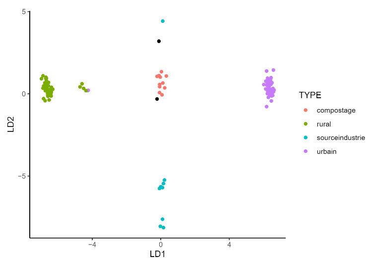

# TP_Factoranalysis
with my colleague Younes we are working on Data from an industrial site to conclude about his influence in the environment, our Data is basically measures of concentration of some chemical molecules in different places around the site.

The data is stored in the xlsx file with 14 quantitative variables and 4 qualitative variables that represent (the season, type of measurement place, Campagne and site index).

A pdf file named TP4 contains the materials of the practical work (it is in French)

A pdf file named "Rapport_ournames" represents the report we wrote using a Markdown file which is also in the repository.

Project.r is like a draft where we try all of our work before assigning it to the Markdown file.

<figure>
  
  <figcaption>Fig - Prediction of the type of  two measurement sites based on all other quantitative and qualitative variables</figcaption>
</figure>
